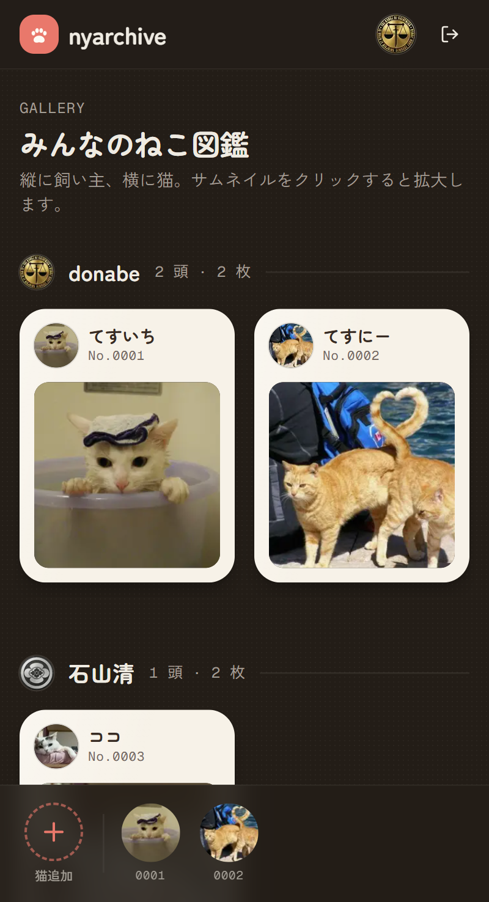
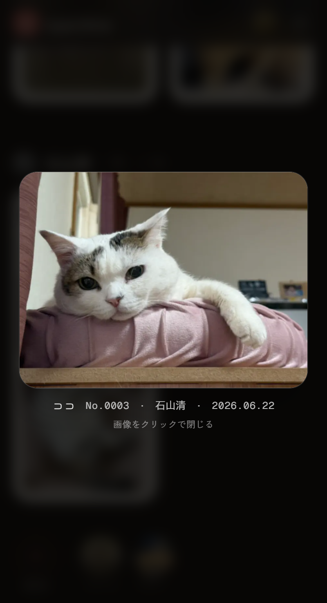
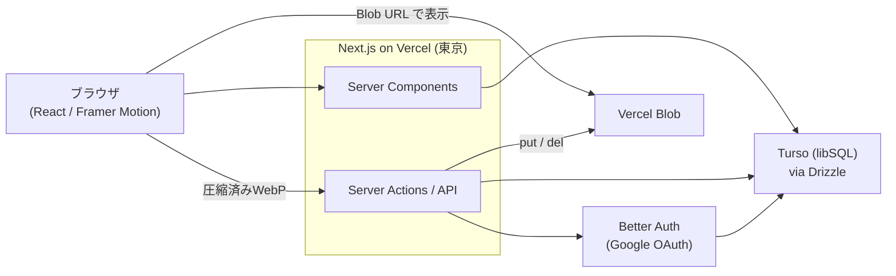

# nyarchive 🐾

飼い猫のプロフィールと写真を「**ねこ図鑑**」として登録・公開・閲覧できるフルスタック Web アプリ。
Google ログイン後、自分の猫を複数登録して写真をアップロードでき、みんなの公開写真をギャラリーで眺められます。

🔗 **Live Demo: https://nyarchive.vercel.app/** （Google アカウントでログイン）

<p align="center">
  
  &nbsp;&nbsp;
  
</p>
<p align="center"><sub>左: 飼い主 × 猫で並ぶギャラリー　／　右: サムネイルをクリックして拡大表示</sub></p>

---

## 主な機能

- **Google ログイン**（Better Auth）
- **猫プロフィール**の追加・変更・削除（1人で複数頭）。種類・誕生日・性格・好き/嫌いなどを登録
- **写真のアップロード**（複数枚まとめて選択可）／**公開・非公開**の切り替え／削除
- **アイコンは登録画像から選択**。未設定なら最初の公開画像を自動採用
- **ギャラリー**：縦に飼い主・横に猫で整理。サムネイルクリックで拡大ポップアップ（肉球が弾くエフェクト付き）
- **権限制御**：自分の猫だけ編集可。**管理者（オーナー）**は全データを操作可能
- **モバイルファースト**の UI

## 技術スタック

| 領域 | 採用技術 | 選定理由（要約） |
| --- | --- | --- |
| フレームワーク | **Next.js 16**（App Router）/ React 19 / TypeScript | Server Components と Server Actions でフロント〜API を一体化 |
| スタイリング | **Tailwind CSS v4** + shadcn/ui（Base UI） | デザインの一貫性とアクセシブルな基盤を両立 |
| アニメーション | **Framer Motion** | 拡大ポップアップやマイクロインタラクション |
| 認証 | **Better Auth**（Google OAuth） | セッション管理を最小構成で |
| DB | **Turso（libSQL/SQLite）** + **Drizzle ORM** | 無料で運用可能。型安全なスキーマ＆クエリ、エッジ志向の軽量DB |
| ストレージ | **Vercel Blob** | 無料で運用可能。画像の保存・配信 |
| 画像最適化 | **browser-image-compression**（クライアントで WebP 化） | 回線・サーバー負荷を削減 |
| テスト | **Vitest**（ユニット＋結合 61 件） | 認可・公開制御などの中核ロジックを保護 |
| ホスティング | **Vercel**（東京リージョン `hnd1`） | 無料で運用可能。DB（東京）と実行環境を揃え低レイテンシ |

## 設計のポイント

- **無料で構築できるWebアプリ**：無料でWebアプリを構築することを前提に `Turso` / `Vercel` / `Vercel Blob` を採用してデプロイ。
- **認可を一元化**：`src/lib/authz.ts` の `requireUser` / `isAdmin` / `canMutate` を全 Server Action 冒頭で検証。「所有者本人 or 管理者のみ変更可」をサーバー側で強制。
- **公開/非公開の徹底**：ギャラリーやアイコンは**公開画像のみ**で解決し、非公開画像が他人に漏れない（`src/lib/queries.ts` の `resolveCatIconUrl` ほか）。
- **画像アップロード設計**：クライアントで WebP 圧縮 → Server Action 経由で Blob に保存。1枚ずつ送ることで Server Action の 4.5MB 本文制限を回避しつつ複数枚に対応。削除時は DB 行と Blob 実体の両方を削除。
- **アイコンを画像と統合**：別アップロードを廃止し `cats.iconImageId` で登録画像を参照。未設定時は最古の公開画像へ自動フォールバック。
- **リージョン最適化**：Vercel Functions（`hnd1`）と Turso（東京）を揃え、SSR 時の DB 往復を短縮。

## アーキテクチャ概要



## ディレクトリ構成（抜粋）

```
src/
  app/
    (app)/                 # 認証必須エリア（共通レイアウト + 底部バー）
      page.tsx             #   ギャラリー
      cats/new/            #   猫の追加
      cats/[id]/           #   猫の詳細・写真管理・アイコン選択
    login/                 # Google ログイン
    api/auth/[...all]/     # Better Auth エンドポイント
  components/              # Gallery / ImagePopup / CatImages / CatIconPicker など
  actions/                 # Server Actions（cats / images）
  lib/                     # auth / authz / db(schema) / queries / blob / image
tests/                     # Vitest（ユニット + インメモリ libSQL の結合テスト）
docs/                      # セットアップ・デプロイ手順、スクリーンショット
```

## ローカル開発

```bash
pnpm install
cp .env.example .env.local   # 値を設定（下記ドキュメント参照）
pnpm db:migrate              # ローカルは file:local.db にスキーマ適用
pnpm dev                     # http://localhost:3000
```

- 認証のセットアップ: [`docs/google-auth-setup.md`](docs/google-auth-setup.md)
- 本番デプロイ手順: [`docs/deployment.md`](docs/deployment.md)

## テスト

```bash
pnpm test        # Vitest を1回実行（61件）
pnpm test:watch  # 監視モード
```

純粋ロジック（年齢算出・ID整形・権限判定）に加え、**インメモリ libSQL** に本番同一スキーマを適用して、認可・公開/非公開フィルタ・アイコン解決・削除時の Blob 連動を結合テストで検証しています。

## スクリプト

| コマンド | 内容 |
| --- | --- |
| `pnpm dev` / `build` / `start` | 開発 / 本番ビルド / 起動 |
| `pnpm test` | テスト実行 |
| `pnpm lint` | ESLint |
| `pnpm db:generate` / `db:migrate` / `db:studio` | マイグレーション生成 / 適用 / Drizzle Studio |
