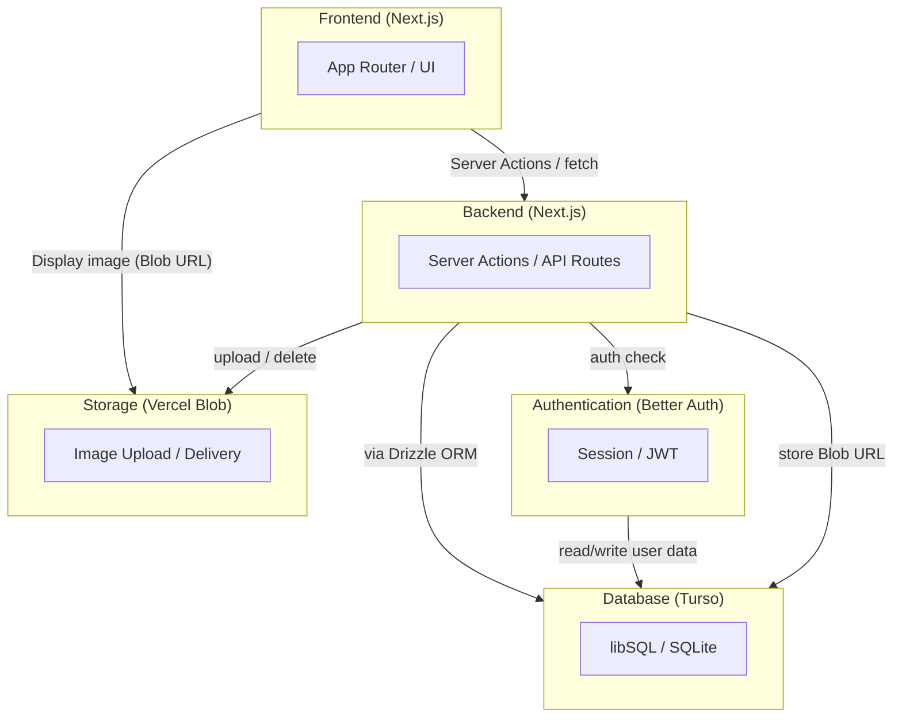

## このファイルについて
Claude Codeで何もない状態からWebアプリを作成したときの流れを把握するために最初のチャットをここに保存している。

`/plan` モードに切り替えて最初は設計フェーズを進める。

---

これから、飼い猫の画像をアップロードしたり閲覧できるWebアプリを作っていきます。
このWebアプリを実装するために必要な内容について壁打ちをしていきたいので、以下の仕様を読んでから私に質問をしてください。

### Webアプリの概要
- 管理者とユーザーは、このWebアプリにGoogleで認証してログインし、猫のプロフィール設定、画像のアップロードができる
- ユーザーは複数の猫のプロフィールを追加／変更／削除ができ、その猫の画像をアップロード／削除ができる
- 管理者は、すべてのデータの追加／変更／削除ができる
- 管理者とユーザーは、ほかのアカウントが登録した猫の画像のギャラリーを閲覧できる
- このアプリには決済の機能は不要
- 管理者は自分だけ（このリポジトリのオーナーのメールアドレス）
- 画像データは圧縮してVercel Blobにアップロードする。

### データ構成
最低限必要なデータ構成は以下の通り。

- 猫のプロフィール
    - ID（追加順に0000からの通し番号を自動で付与。変更不可）
    - 猫の名前
    - 猫のアイコン用の画像
    - 猫の種類（以下の種類から選択可能とするが、任意の文字列も入力可能）
        - 茶トラ
        - キジトラ
        - サバトラ
        - ハチワレ
        - ミケ
        - サビ
        - シロ
        - クロ
        - ブチ
    - 年齢、生まれた日時
    - 性格
    - 好きなもの
    - 嫌いなもの
    - 飼い主（登録したユーザーを自動で設定。変更不可）

- 猫の画像の情報
    - アップロード日（自動で付与。変更不可）
    - 公開／非公開

- ユーザーデータ
    - 自分が登録した猫のリスト

### 画面構成
#### ログイン画面
- Google認証でログインの認証を行う
- ログイン成功したらメイン画面へ遷移

#### 共通のUI
- 今回はサイドバーは使用しない

#### メイン画面
- 縦で飼い主ごと、横で猫ごとにカテゴリ分けして、サムネイル画像を表示し、縦横スクロール可能な画面にする
- 縮小した画像をクリックすると、かわいいエフェクトを表示後に画像を拡大してポップアップ表示。ポップアップ中に画像をクリックするとポップアップ表示を閉じる。
- 画面の底部の左端に［猫追加］のアイコンを常時表示。アイコンをクリックすると「猫追加画面」へ遷移する
- ［猫追加］のアイコンの右隣りに追加済みの猫のアイコンを水平に並べて表示（水平スクロール可能）。猫のアイコンをクリックしたら「猫の画像追加画面」へ遷移
- 非公開の画像は表示されない

#### 猫追加画面
- 猫のプロフィールの情報を登録できる。
- ［決定］ボタンを押下すると、画面の底部の［猫追加］のアイコンの右隣りに、今決定した猫のアイコン画像を追加して表示する

#### 猫の画像追加画面
- ここへ遷移する際にクリックした猫のプロフィールやその猫の画像を表示します。
- 画面上部に選択中の猫のプロフィール情報を表示し変更可能。［変更］ボタンで変更。［削除］ボタンでプロフィールと追加済みの画像を全削除
- 画面下部の左端に［画像追加］アイコンを表示、このアイコンをクリックすると、画像を選択してアップロードする。
- ［画像追加］アイコンの右隣りに追加済みの画像のサムネイルを表示（水平スクロール可能）。画像をクリックすると［公開／非公開］の切り替えボタンと［削除］ボタンを表示
- 非公開の画像は表示されない

### コンポーネントの構成
**Components List**
| Component | Technology | Details |
| --- | --- | --- |
| Frontend | Next.js | App Router / UI |
| Backend | Next.js | Server Actions / API |
| Database | Turso | libSQL / SQLite |
| Authentication | Better Auth | Session / JWT |
| Storage | Vercel Blob | Image Upload / Delivery |

**Components Chart**

### 使用するSkills
frontend-design, vercel-react-best-practices, web-design-guidelines

### 実装計画の出力
プランが完成したら、Markdown形式で出力してください。

---

